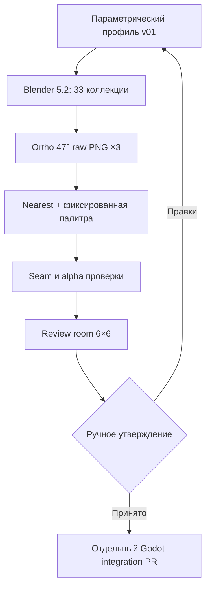

# Blender Environment Factory v01: холодный древний камень

## Статус

Этап создаёт **review candidate**, а не утверждённые игровые ресурсы. Его
задача — получить первый воспроизводимый вертикальный срез окружения и
проверить его в реальном масштабе до изменения `game.tscn`.

## Исправленный размерный контракт

В проекте существуют два разных размера:

| Контракт | Значение | Источник |
|---|---:|---|
| Одна клетка 5 футов | 64 px | `DistanceSystem.PIXELS_PER_5_FEET` |
| Холст gameplay-персонажа | 96×96 px | `HumanWarriorAnimationLibrary` |

Поэтому тайл пола экспортируется в 64×64, а персонаж высотой около 78 px
остаётся на прозрачном холсте 96×96 и естественно перекрывает соседнюю часть
пола. Перевод сетки на 96 px не входит в арт-задачу: он изменил бы дальности,
маршруты, AI, геометрию столкновения и сохранённые позиции.

## Производственная схема

Blender создаёт геометрию, материалы, нейтральный свет и raw PNG. Отдельный
Pillow-проход выполняет только техническую нормализацию: точный размер,
`Nearest`, ограничение палитры, alpha-контракт, общую edge-signature и review
композицию. Он не заменяет Blender художественной отрисовкой.

## Бесшовность без шахматной доски

Один тайл содержит девять камней разной ширины, поэтому клетка не выглядит
одной плитой. Blender рендерит центральную область в окружении 3×3 повторов.
После квантизации постпроцессор согласует `left/right` и `top/bottom` внутри
каждого варианта по его собственным соседним пикселям.

Все граничные пиксели непрозрачны, поэтому при `Nearest` между произвольными
вариантами не возникает щели или texture bleeding. Края разных вариантов не
делаются побитно одинаковыми: общий искусственный бордюр создавал заметную
сетку 64×64. Небольшой переход оттенка теперь выглядит как естественный стык
двух соседних камней. Художественная заметность повторов проверяется по
комнате 6×6.

## Слои

| Производственный слой | Результат v01 | Будущий Godot-слой |
|---|---|---|
| Базовый пол | 8 opaque PNG 64×64 | `TileMapLayer/Floor` |
| Декали | crack, dust, damp | `TileMapLayer/Decals` |
| Переходы | dry→damp N/E/S/W | `TileMapLayer/Transitions` |
| Границы | 4 edge walls + 4 corners | отдельный edge visual layer |
| Интерактив | door x/y, closed/open | отдельные door scenes |
| Структуры | короткая лестница | structure layer/scene |
| Арканный акцент | 2 transparent overlays | decal/effect layer |
| Освещение | отсутствует в floor PNG | отдельный Godot light layer |

Стена и дверь получают `placement_contract = cell_edge`. Их изображения не
определяют коллизию, обзор или AI: механическая edge-геометрия остаётся в
`CombatEnvironment`.

## Палитра и свет

Палитра содержит 24 цвета: холодный сине-серый камень, тёмный раствор,
сырость, дерево, металл и три цвета арканной инкрустации. В сцене нет тёплого
факельного света. Три нейтральных широких источника нужны только для читаемого
рельефа; цвет локального освещения добавляется в Godot и не запекается в пол.

Арканный материал использует emission только как цвет самой линии. Bloom и
световое загрязнение соседнего камня отключены контрактом.

## Граница этапа

До ручного просмотра настоящий Blender render нельзя:

- переносить в `assets/environment/approved`;
- подключать к `game.tscn`;
- объявлять финальным;
- заменять им механические стены и двери;
- собирать APK только ради этого промежуточного прохода.

После принятия review-комнаты следующий PR должен создать импортированные
атласы, `TileSet`/`TileMapLayer`, fallback старого `Polygon2D` и отдельную
демонстрационную сцену. Только затем набор проверяется в Godot на Android.
