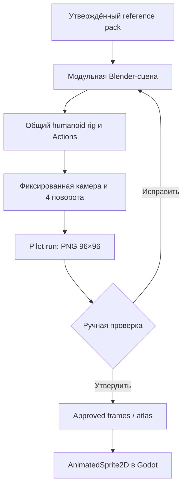

# Архитектура Blender Sprite Factory

## Решение

Проект остаётся 2D-RPG. Blender — внешняя фабрика исходников, а не новая
runtime-подсистема игры.

Android получает только `G`: прозрачные PNG и ресурс `SpriteFrames`. Стоимость
3D-рендера, число мешей и сложность рига не влияют на мобильный runtime.

## Почему это не просто «модель с одной текстурой»

Текстура меняет цвет и рисунок поверхности, но не силуэт. Поэтому контракт
делит персонажа на два типа замен:

| Изменение | Производственный механизм |
|---|---|
| Цвет кожи, ткани или металла | texture slot |
| Рисунок кольчуги или кожи | texture slot |
| Большой/малый наплечник | отдельный mesh module |
| Волосы, шарф, сумка, меч | отдельный mesh module |
| Рост и пропорции расы | отдельный body profile на совместимом rig |
| Ходьба, удар, получение урона | переиспользуемый Blender Action |

Так модель не превращается в один неразделимый меш, но и игра не рендерит
много синхронных слоёв без необходимости.

## Стабильные идентификаторы

- character: `human_warrior_m01`;
- rig: `RIG_human_warrior_m01`;
- Actions: `human_warrior_m01_idle`,
  `human_warrior_m01_walk_down`;
- modules: `body_base`, `head`, `hair`, `scarf`, `chainmail`,
  `torso_armor`, `pauldron_left_large`, `pauldron_right_small`, `arms`,
  `legs`, `boots`, `back_cloth`, `sword_scabbard`, `pouch`;
- material slots: `skin`, `hair`, `scarf`, `leather_dark`, `leather_mid`,
  `chainmail`, `silver`, `dark_steel`, `boots`.

Эти ID не зависят от отображаемого имени персонажа и пригодны для будущего
batch-экспорта.

## Физические стороны

Модель смотрит вперёд по оси `-Y`, вверх — по `+Z`.

- физическая левая сторона персонажа — `+X`;
- большой серебряный наплечник, меч и ножны — слева;
- малый тёмный наплечник и подсумок — справа.

Камера фиксирована. Для направлений поворачивается весь rig:

| Направление | Поворот Z |
|---|---:|
| down | 0° |
| left | −90° |
| right | +90° |
| up | 180° |

Отрицательный масштаб и зеркалирование запрещены.

## Камера и нормализация

- ортографическая проекция;
- угол сверху 47° внутри утверждённого диапазона 45–50°;
- raw-render 192×192;
- нормализация nearest-neighbor;
- gameplay-холст 96×96;
- высота proxy 78 px;
- базовая линия `y=91`;
- бинарный alpha;
- палитра пилота квантуется к цветам, извлечённым из approved master.

Технические размеры не дублируются как независимый стандарт: factory читает
их из существующего
`tools/sprite_pipeline/configs/human_warrior_m01.json`.

## Граница текущего этапа

Пилот создаёт процедурный low-poly proxy. Он должен доказать:

- воспроизводимость сцены;
- работу модульного rig/material контракта;
- настоящие четыре направления;
- единый масштаб и точку опоры;
- полный цикл одного направления;
- отсутствие зависимости Android от 3D.

Он ещё не доказывает:

- точное совпадение лица с master;
- финальную форму волос и доспеха;
- утверждённую пиксельную палитру;
- отсутствие мерцания после реального рендера;
- качество в Godot на телефоне.

Эти пункты нельзя закрыть без запуска Blender и просмотра PNG.

Профиль тела `silhouette v03` принят как техническая основа после реального
Blender-рендера: общий фронтальный габарит стал 42 px против 44 px у
approved reference, опорная стойка читается во всех четырёх настоящих
поворотах, а вид со спины почти совпадает по нижнему контуру. Дальнейшее
расширение ног или ткани ухудшило бы уже правильный задний ракурс.

Реальный рендер `head v01 / proxy_v04` подтвердил работу отдельной головы во
всех четырёх направлениях, но показал предел исходных размеров: после
nearest-neighbor нормализации лицо остаётся слишком маленьким, его черты
сливаются, а заднему ракурсу по-прежнему недостаёт высоты над плечами.

Активный кандидат `head v02 / proxy_v05` увеличивает только пиксельный запас
головы: сохраняет размер черепа, усиливает взрослую челюсть, разводит брови,
глаза и рот по высоте, открывает линию волос и симметрично разносит переднюю и
заднюю верхние пряди по глубине. Это должно восстановить экранную высоту
`idle_down` и `idle_up` без увеличения головы. Принятый `silhouette v03`,
камера, палитра, экипировка и Actions не меняются. `head v01` сохранён в коде
как воспроизводимая предыдущая ревизия. Профиль головы версионируется и
хешируется отдельно от силуэта, чтобы будущие лица не требовали копирования
body profile.

## Следующие расширения после принятия пилота

1. проверить `head v02` по новому реальному рендеру `proxy_v05`;
2. локально довести лицо и волосы до каноничной читаемости;
3. уточнить левый/правый наплечники и оружейный модуль;
4. утвердить texture slots;
5. довести `walk_down`;
6. только затем рендерить остальные `walk`;
7. подключить утверждённые кадры к существующему
   `AnimatedSprite2D`-контроллеру из PR №27.

Полный генератор рас, все комплекты брони и живая смена экипировки не входят в
пилот: для них пока нет проверенного вертикального среза.
